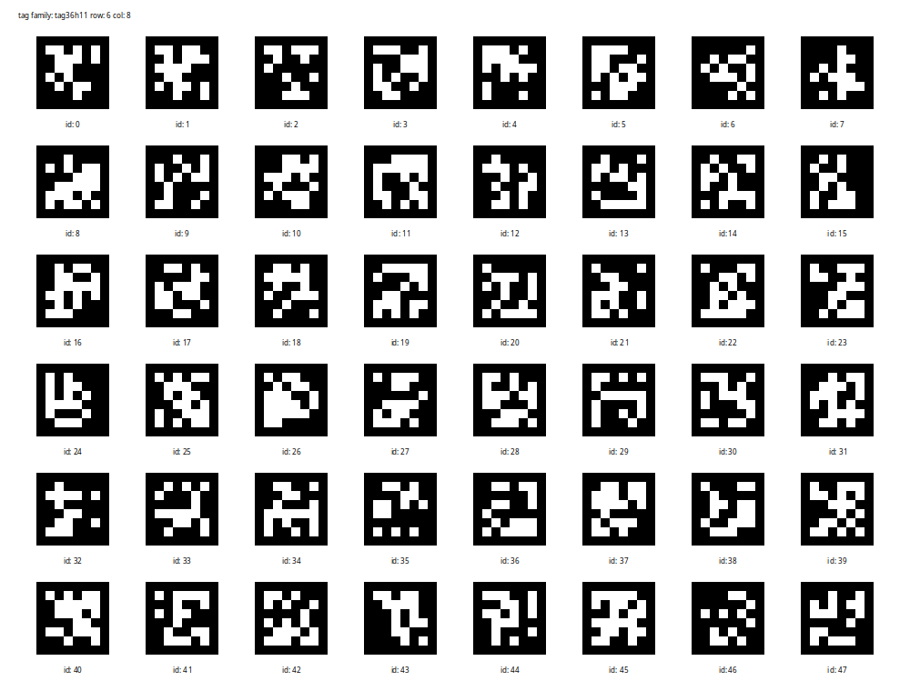

# 生成Apriltag标定板的工具

本脚本用于生成apriltag grid 标定板矢量图、像素图以及相应的配置文件信息，可用于标定等用途。

## 示例

脚本参数

```shell
usage: apriltag_generate.py [-h] -f TAG_FAMILY -s TAG_SIZE -r ROW -c COL -t TAG_SPACING [-o OUTPUT] [-ds] [-di] [-dg]

options:
  -h, --help            show this help message and exit
  -f TAG_FAMILY, --tag_family TAG_FAMILY
  -s TAG_SIZE, --tag_size TAG_SIZE
  -r ROW, --row ROW
  -c COL, --col COL
  -t TAG_SPACING, --tag_spacing TAG_SPACING
  -o OUTPUT, --output OUTPUT
  -ds, --draw_spacing   draw tag spacing
  -di, --draw_id        draw tag id
  -dg, --draw_grid      draw grid
```

其中参数 TAG_SIZE 、 TAG_SPACING 单位是米.

举例

```shell
apriltag_generate.py -f tag36h11 -s 0.0164 -r 6 -c 8 -t 0.0082 -o output/update_test  -di
```

使用tag36h11创建6行8列的标定板，tag边长0.0164m，边到边间隔0.0082m ，输出到output/update_test文件， 绘制tag id



## config

```yaml
col: 8
row: 6
tag_family: tag36h11
tag_size: 2.0 # tag size in m
tag_spacing: 1.0 # tag spacing in m
tag_obj_points: # tag corner point in world
  0:# tagid
    center:
    - 2.0
    - 2.0
    corners:
    - - 1.0
      - 1.0
      - 0
    - - 3.0
      - 1.0
      - 0
    - - 3.0
      - 3.0
      - 0
    - - 1.0
      - 3.0
      - 0
      
```
